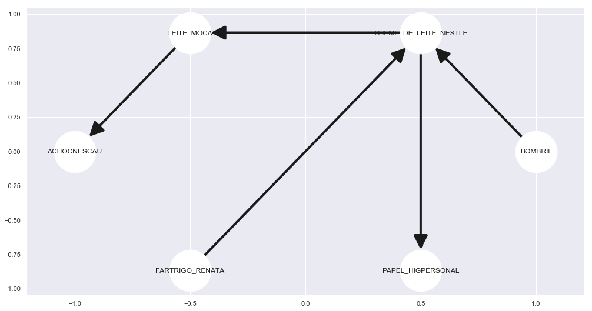

# Atividade IA - Regras de Associação

 * Tarefa sobre regras de associação utilizando dataset do supermercado dotto

# Importando as bibliotecas 


```python
import unidecode
import numpy as np
import pandas as pd
# Matplotlib for additional customization
from matplotlib import pyplot as plt
%matplotlib inline
import seaborn as sns
sns.set()
plt.rcParams['figure.figsize'] = (17,9) # Bigger figures sizes
```

# Funções de auxilío 


```python
def norm(string):
    """Normalizes pt-br string

    Arguments:
        string {str} -- a portuguese type string (ex: não, é muito pouco...)

    Returns:
        str -- a normalized string (ex: nao, e muito pouco)
    """
    if(isinstance(string, list)):
        string = " ".join(string)

    s = unidecode.unidecode(string)
    s = s.lower().strip()
    return s
```

# Pré-processamento de dados

* Arquivo: dotto.data
* Lendo como csv separado por espaço


```python
# Descobrindo a maior compra
max_items = -1

with open('dotto.data', mode='r+', encoding='ISO-8859-1') as file:
    for line in file:
        line = norm(line)
        # Quebrando em lista
        length_line = len(line.split(' '))
        
        if length_line > max_items:
            max_items = length_line

# max_items tem a maior compra agora
print('Maior compra %d' % max_items)
```

    Maior compra 170


```python
# Lendo como um pd.DataFrame, enconding não é utf-8 por algum motivo.
data = pd.read_csv('dotto.data', delim_whitespace=True, header=None, names=range(max_items), encoding='ISO-8859-1')
data.head(10)
```


<div>
<style scoped>
    .dataframe tbody tr th:only-of-type {
        vertical-align: middle;
    }

    .dataframe tbody tr th {
        vertical-align: top;
    }

    .dataframe thead th {
        text-align: right;
    }
</style>
<table border="1" class="dataframe">
  <thead>
    <tr style="text-align: right;">
      <th></th>
      <th>0</th>
      <th>1</th>
      <th>2</th>
      <th>3</th>
      <th>4</th>
      <th>5</th>
      <th>6</th>
      <th>7</th>
      <th>8</th>
      <th>9</th>
      <th>...</th>
      <th>160</th>
      <th>161</th>
      <th>162</th>
      <th>163</th>
      <th>164</th>
      <th>165</th>
      <th>166</th>
      <th>167</th>
      <th>168</th>
      <th>169</th>
    </tr>
  </thead>
  <tbody>
    <tr>
      <th>0</th>
      <td>AGUA_SANITCANDURA</td>
      <td>CERA_BRAVO</td>
      <td>NaN</td>
      <td>NaN</td>
      <td>NaN</td>
      <td>NaN</td>
      <td>NaN</td>
      <td>NaN</td>
      <td>NaN</td>
      <td>NaN</td>
      <td>...</td>
      <td>NaN</td>
      <td>NaN</td>
      <td>NaN</td>
      <td>NaN</td>
      <td>NaN</td>
      <td>NaN</td>
      <td>NaN</td>
      <td>NaN</td>
      <td>NaN</td>
      <td>NaN</td>
    </tr>
    <tr>
      <th>1</th>
      <td>ACUCAR_DA_BARRA</td>
      <td>AGUA_SANITVAREK</td>
      <td>ALCOOL_CANDURA</td>
      <td>ARROZ_PRATO_FINO</td>
      <td>AZEITE_CARBONELL</td>
      <td>BISCSAO_CARLOS</td>
      <td>BOMBOM_LACTA</td>
      <td>CAFE_SERRA_DA_GRAMA</td>
      <td>CALDO_KNORR</td>
      <td>CHEIRO_VERDE</td>
      <td>...</td>
      <td>NaN</td>
      <td>NaN</td>
      <td>NaN</td>
      <td>NaN</td>
      <td>NaN</td>
      <td>NaN</td>
      <td>NaN</td>
      <td>NaN</td>
      <td>NaN</td>
      <td>NaN</td>
    </tr>
    <tr>
      <th>2</th>
      <td>AGUA_SANITVAREK</td>
      <td>CAPELETTI_MEZZANI</td>
      <td>FILE_PEITO_FRANGO_SADIA</td>
      <td>HARPIC_LIQATIVO</td>
      <td>LEITE_NILZA</td>
      <td>LEITE_PARMALAT</td>
      <td>MARGBECEL</td>
      <td>PAPEL_HIGPERSONAL</td>
      <td>PIMENTA_COMARI_CEPERA</td>
      <td>NaN</td>
      <td>...</td>
      <td>NaN</td>
      <td>NaN</td>
      <td>NaN</td>
      <td>NaN</td>
      <td>NaN</td>
      <td>NaN</td>
      <td>NaN</td>
      <td>NaN</td>
      <td>NaN</td>
      <td>NaN</td>
    </tr>
    <tr>
      <th>3</th>
      <td>ACUCAR_UNIAO</td>
      <td>CAFE_CABOCLO</td>
      <td>FANTA</td>
      <td>LEITE_MOCA</td>
      <td>LEITE_PARMALAT</td>
      <td>MANTEIGA_BATAVO</td>
      <td>REQNILZA</td>
      <td>SPRITE</td>
      <td>ZIPLOC_POTE</td>
      <td>NaN</td>
      <td>...</td>
      <td>NaN</td>
      <td>NaN</td>
      <td>NaN</td>
      <td>NaN</td>
      <td>NaN</td>
      <td>NaN</td>
      <td>NaN</td>
      <td>NaN</td>
      <td>NaN</td>
      <td>NaN</td>
    </tr>
    <tr>
      <th>4</th>
      <td>ADES_ORIGINAL</td>
      <td>LEITE_PARMALAT</td>
      <td>NaN</td>
      <td>NaN</td>
      <td>NaN</td>
      <td>NaN</td>
      <td>NaN</td>
      <td>NaN</td>
      <td>NaN</td>
      <td>NaN</td>
      <td>...</td>
      <td>NaN</td>
      <td>NaN</td>
      <td>NaN</td>
      <td>NaN</td>
      <td>NaN</td>
      <td>NaN</td>
      <td>NaN</td>
      <td>NaN</td>
      <td>NaN</td>
      <td>NaN</td>
    </tr>
    <tr>
      <th>5</th>
      <td>ABSINTGEL</td>
      <td>ACHOCNESCAU</td>
      <td>ACUCAR_UNIAO</td>
      <td>ADES_LIGHT_MACA_ALIMLIQDE_SOJA</td>
      <td>AGUA_SANITVAREK</td>
      <td>AJAX_BOUQUET_FLORES_DO_SOL</td>
      <td>ALFACE_MIMOSA_BIO_TERRA</td>
      <td>ALHO_DA_ROCA</td>
      <td>AMACCANDURA</td>
      <td>ARROZ_ALBARUSKA</td>
      <td>...</td>
      <td>NaN</td>
      <td>NaN</td>
      <td>NaN</td>
      <td>NaN</td>
      <td>NaN</td>
      <td>NaN</td>
      <td>NaN</td>
      <td>NaN</td>
      <td>NaN</td>
      <td>NaN</td>
    </tr>
    <tr>
      <th>6</th>
      <td>ADES_MACA_ALIMLIQDE_SOJA</td>
      <td>ADES_PESSEGO</td>
      <td>AGUA_PRATA</td>
      <td>AMACCOMFORT</td>
      <td>BISCNESTLE</td>
      <td>BISNAGUINHA_PANCO</td>
      <td>BROCOLIS</td>
      <td>CARRETO</td>
      <td>DETERGLIMPOL</td>
      <td>FILTRO_PAPEL_MELITTA</td>
      <td>...</td>
      <td>NaN</td>
      <td>NaN</td>
      <td>NaN</td>
      <td>NaN</td>
      <td>NaN</td>
      <td>NaN</td>
      <td>NaN</td>
      <td>NaN</td>
      <td>NaN</td>
      <td>NaN</td>
    </tr>
    <tr>
      <th>7</th>
      <td>DESBA_BANHO</td>
      <td>SHALL_CLEAR</td>
      <td>NaN</td>
      <td>NaN</td>
      <td>NaN</td>
      <td>NaN</td>
      <td>NaN</td>
      <td>NaN</td>
      <td>NaN</td>
      <td>NaN</td>
      <td>...</td>
      <td>NaN</td>
      <td>NaN</td>
      <td>NaN</td>
      <td>NaN</td>
      <td>NaN</td>
      <td>NaN</td>
      <td>NaN</td>
      <td>NaN</td>
      <td>NaN</td>
      <td>NaN</td>
    </tr>
    <tr>
      <th>8</th>
      <td>AGUA_DE_COCO_SOCOCO</td>
      <td>BALAS_RECHMEL_DORI</td>
      <td>CHOCNESTLE</td>
      <td>CORN_FLAKES_KELLOG_S</td>
      <td>LEITE_NILZA</td>
      <td>MARGDORIANA</td>
      <td>NaN</td>
      <td>NaN</td>
      <td>NaN</td>
      <td>NaN</td>
      <td>...</td>
      <td>NaN</td>
      <td>NaN</td>
      <td>NaN</td>
      <td>NaN</td>
      <td>NaN</td>
      <td>NaN</td>
      <td>NaN</td>
      <td>NaN</td>
      <td>NaN</td>
      <td>NaN</td>
    </tr>
    <tr>
      <th>9</th>
      <td>ADES_MACA_ALIMLIQDE_SOJA</td>
      <td>BALA_CHITA</td>
      <td>BISNAGUINHA_PULLMAN</td>
      <td>CREME_DE_LEITE_NESTLE</td>
      <td>DETERGYPE</td>
      <td>FILE_PEITO_FRANGO_SADIA</td>
      <td>FOSFORO_FIAT_LUX</td>
      <td>LEITE_MOCA</td>
      <td>LUSTRA_MOVPOLIFLOR</td>
      <td>MACBARILLA</td>
      <td>...</td>
      <td>NaN</td>
      <td>NaN</td>
      <td>NaN</td>
      <td>NaN</td>
      <td>NaN</td>
      <td>NaN</td>
      <td>NaN</td>
      <td>NaN</td>
      <td>NaN</td>
      <td>NaN</td>
    </tr>
  </tbody>
</table>
<p>10 rows × 170 columns</p>
</div>


```python
# Vizualizando a distribuição dos produtos
# Transformando em ocorrências
ocorrencias = data.stack().value_counts().reset_index()
# Plotando os 10 mais comprados
top10_plot = sns.barplot(x=ocorrencias.head(10)[0], y=ocorrencias.head(10)['index'])
top10_plot.set(xlabel='Quantidade', ylabel='Produto', title='Top 10')
plt.yticks(rotation=35)
plt.show()
```


# Modelo Apriori

## Valores minimos para suporte, confiança e lift.
Considerando que o periodo da coleta dos dados seja de uma semana.

### Suporte
O suporte indica a frequência com que um itemset ou com que A e B ocorrem juntos no conjunto de dados
* Pegaremos os produtos que são vendidos pelo menos 4 vezes no dia.
* Então durante uma semana ele sera vendido 4*7 vezes.
* Logo o suporte minimo será (4*7)/Total(1716) = 0.017

### Confiança
A confiança de uma regra A => B é a probabilidade condicional da transação conter o conjunto de itens B, dado que contém o conjunto A.
* Valores altos de confiança geram regras óbvias.
* Valores baixos podem gerar regras erradas para aquele tipo de modelo de negócios.
* Como 1716 ainda não é muito usaremos uma confiança não muito alta nem tão baixa entre 0.3 e 0.4.

### Lift
A medida Lift, também conhecida por Interest, é uma das mais utilizadas para avaliar dependências entre itemsets.
Leva em consideração o peso da popularidade de B também.
* lift(A => B) = 1: A e B são independentes
* lift(A => B) > 1: A e B são positivamente dependentes
* lift(A => B) < 1: A e B são negativamente dependentes
* Intervalo: [0, ∞[
* Simétrica.
* Quanto maior o valor de Lift, mais interessante a regra.
* O valor de minimo de lift será 3 por razões de teste em outras situações.


```python
# apyori biblioteca simples do apriory
from apyori import apriori
transacoes = data.fillna('NaN').values
# Transacoes
regras = apriori(transacoes, min_support = 0.017, min_confidence = 0.45, min_lift = 3)
# Ordenando por lift
regras = sorted(regras, key = lambda x: int(x[2][0][3]), reverse=True)

top5_regras = regras[0:5]
```

# Analisando as regras obtidas


```python
import networkx as nx

options = {
    'node_color': 'white',
    'node_size': 5000,
    'width': 4,
    'arrowstyle': '-|>',
    'arrowsize': 50,
    'fontsize': 16
}

g = nx.DiGraph(directed=True)

nodes = []
for item in top5_regras:
    # Primeiro indice da primeira lista interna
    # Contem o item base e o segundo item
    pair = item[0] 
    items = [x for x in pair]
    nodes.append(items[0])
    nodes.append(items[1])
    
    g.add_nodes_from(nodes)
    g.add_edge(items[0],items[1])
    
    print("Regra: " + items[0] + " -> " + items[1])

    # Segundo indice é o suporte
    print("Support: " + str(item[1]))

    print("Confiança: " + str(item[2][0][2]))
    print("Lift: " + str(item[2][0][3]))
    print("=====================================")  

pos = nx.circular_layout(g)

nx.draw_networkx(g, pos,**options)
plt.show()
```

    Regra: BOMBRIL -> CREME_DE_LEITE_NESTLE
    Support: 0.017482517482517484
    Confiança: 0.9375000000000001
    Lift: 8.467105263157896
    =====================================
    Regra: LEITE_MOCA -> ACHOCNESCAU
    Support: 0.019813519813519812
    Confiança: 0.7906976744186045
    Lift: 7.141248470012239
    =====================================
    Regra: CREME_DE_LEITE_NESTLE -> LEITE_MOCA
    Support: 0.023892773892773892
    Confiança: 0.7884615384615384
    Lift: 7.121052631578947
    =====================================
    Regra: FARTRIGO_RENATA -> CREME_DE_LEITE_NESTLE
    Support: 0.019813519813519812
    Confiança: 0.8499999999999999
    Lift: 7.676842105263157
    =====================================
    Regra: CREME_DE_LEITE_NESTLE -> PAPEL_HIGPERSONAL
    Support: 0.017482517482517484
    Confiança: 0.7894736842105264
    Lift: 7.130193905817176
    =====================================





# Conclusão
* Nota-se que algumas regras são realmente validas e até óbvias como LEITE_MOCA + ACHNESCAU = Brigadeiro e outras parecem ser totalmente estranhas BOMBRIL + CREME_DE_LEITE_NESTLE
